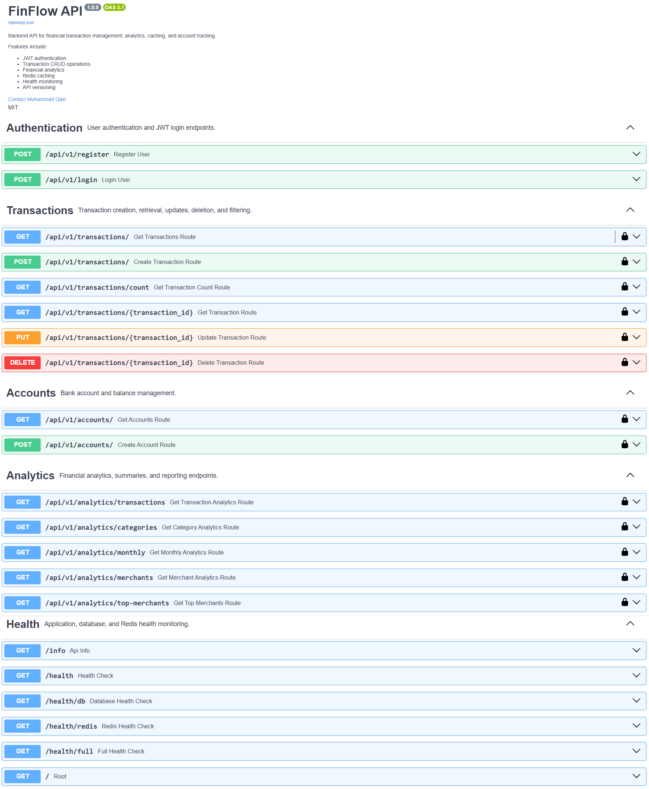
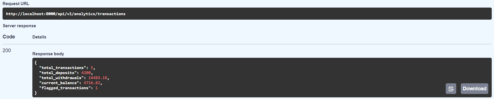

# FinFlow API

[](https://github.com/mqazi3/finflow-api/actions/workflows/tests.yml)

A cloud-deployed financial transaction backend built with Python, FastAPI, PostgreSQL, Redis, Docker, and AWS ECS/Fargate.

FinFlow provides authenticated, user-scoped APIs for managing financial accounts and transactions, querying transaction data, and generating financial analytics. The application uses PostgreSQL for persistent storage and Redis for caching analytics results.

## Screenshots

Interactive API documentation generated by FastAPI, showing all 21 routes:



Transaction analytics for a demo user with five transactions, including one flagged purchase over $10,000:



## Architecture

FinFlow uses a containerized backend architecture deployed on AWS:

- **API:** FastAPI application running in Docker on AWS ECS/Fargate
- **Database:** PostgreSQL hosted on Amazon RDS
- **Caching:** Redis hosted on Amazon ElastiCache
- **Container Registry:** Amazon ECR
- **Logging:** Amazon CloudWatch
- **Authentication:** JWT-based authentication with password hashing

```text
Client
  |
  v
FastAPI API
(AWS ECS/Fargate)
  |
  +-----------> PostgreSQL
  |             (Amazon RDS)
  |
  +-----------> Redis
                (Amazon ElastiCache)

Docker Image -> Amazon ECR
Application Logs -> Amazon CloudWatch
```

## Features

- User registration and login with JWT-based authentication
- Password hashing with bcrypt
- User-scoped account and transaction operations with ownership checks
- Transaction creation and retrieval
- Search and filtering by transaction attributes
- Pagination for transaction queries
- Financial analytics including transaction totals, deposits, withdrawals, balances, and flagged transactions
- Exact decimal money handling: amounts and balances stored as `NUMERIC(12, 2)`, never floats
- Redis caching for per-user analytics with a 60-second TTL
- PostgreSQL persistence using SQLAlchemy
- Application and dependency health-check endpoints
- Dockerized local and cloud deployment
- Database schema managed by Alembic migrations, applied automatically on container startup
- 47 automated tests run in GitHub Actions on every push

## Engineering Highlights

- Built 20+ API routes spanning authentication, account management, transaction CRUD, analytics, and service health
- Enforced user-scoped data access across account and transaction operations
- Implemented transaction filtering, search, pagination, and account-balance updates
- Added Redis caching for per-user transaction analytics, invalidated on transaction create, update, and delete, with a database fallback when Redis is unavailable
- Stored money as exact decimals and computed analytics with SQL aggregates rather than application-side loops
- Wrote a pytest suite covering authentication, token forgery and expiry, cross-user data isolation, balance math, analytics, and health checks; CI runs it against PostgreSQL, verifies migrations match the models, and smoke-tests the full Docker Compose stack
- Deployed a containerized FastAPI service with PostgreSQL and Redis using AWS ECS/Fargate, RDS, ElastiCache, ECR, and CloudWatch

## Tech Stack

| Category | Technologies |
|---|---|
| Language & API | Python, FastAPI |
| Database | PostgreSQL, SQLAlchemy, Alembic |
| Caching | Redis |
| Authentication | JWT, bcrypt |
| Testing & CI | pytest, GitHub Actions |
| Containerization | Docker |
| AWS | ECS/Fargate, ECR, RDS, ElastiCache, CloudWatch |

## Project Structure

```text
finflow-api/
├── app/
│   ├── dependencies/     # Shared FastAPI dependencies
│   ├── models/           # SQLAlchemy database models
│   ├── routes/           # API route definitions
│   ├── schemas/          # Request and response schemas
│   ├── services/         # Application and business logic
│   ├── auth.py           # Authentication and JWT utilities
│   ├── cache.py          # Redis caching configuration
│   ├── config.py         # Application configuration
│   ├── database.py       # Database connection and session setup
│   ├── logger.py         # Logging configuration
│   └── main.py           # FastAPI application entry point
├── alembic/              # Database migration files
├── docs/images/          # README screenshots
├── tests/                # pytest suite
├── .github/workflows/    # CI pipeline
├── .env.example          # Example environment configuration
├── Dockerfile            # API container definition
├── docker-compose.yml    # Local multi-container environment
├── alembic.ini           # Alembic configuration
├── pytest.ini            # Test configuration
├── requirements-dev.txt  # Test dependencies
└── requirements.txt      # Python dependencies
```

## API Endpoints

### Authentication

| Method | Endpoint | Description |
|---|---|---|
| POST | `/api/v1/register` | Register a new user |
| POST | `/api/v1/login` | Authenticate a user and issue a JWT bearer token |

### Accounts

| Method | Endpoint | Description |
|---|---|---|
| POST | `/api/v1/accounts/` | Create an account for the authenticated user |
| GET | `/api/v1/accounts/` | Retrieve accounts belonging to the authenticated user |

### Transactions

| Method | Endpoint | Description |
|---|---|---|
| POST | `/api/v1/transactions/` | Create a transaction |
| GET | `/api/v1/transactions/` | Query user transactions with filtering, search, and pagination |
| GET | `/api/v1/transactions/count` | Count transactions using optional category and search filters |
| GET | `/api/v1/transactions/{transaction_id}` | Retrieve a specific user-owned transaction |
| PUT | `/api/v1/transactions/{transaction_id}` | Update a transaction and recalculate its account balance |
| DELETE | `/api/v1/transactions/{transaction_id}` | Delete a transaction and update its account balance |

### Analytics

| Method | Endpoint | Description |
|---|---|---|
| GET | `/api/v1/analytics/transactions` | Retrieve transaction-level financial analytics |
| GET | `/api/v1/analytics/categories` | Summarize transactions by category |
| GET | `/api/v1/analytics/monthly` | Retrieve monthly analytics with optional date-range filtering |
| GET | `/api/v1/analytics/merchants` | Summarize transaction activity by merchant |
| GET | `/api/v1/analytics/top-merchants` | Retrieve top spending merchants |

### Health & Service Information

| Method | Endpoint | Description |
|---|---|---|
| GET | `/` | Service entry point and API metadata |
| GET | `/info` | Application version, environment, and feature information |
| GET | `/health` | Basic application health check |
| GET | `/health/db` | PostgreSQL connectivity check |
| GET | `/health/redis` | Redis connectivity check |
| GET | `/health/full` | Combined application, PostgreSQL, and Redis health check |

## Authentication & Authorization

FinFlow uses JWT-based authentication to protect user data and API operations.

- Passwords are hashed using bcrypt before storage
- Successful login issues a JWT bearer token, signed with a secret loaded from the environment
- The API refuses to start outside development without a `SECRET_KEY`
- Protected endpoints resolve the authenticated user from the token
- Account and transaction queries are scoped to the authenticated user
- User-specific transaction lookups return `404` when the transaction is missing or not owned by the current user

## Data Model & Caching

FinFlow uses a relational data model centered on users, accounts, and transactions.

- Accounts are created with the authenticated user's ID and retrieved only within that user's scope
- Accounts contain transaction records
- Transaction creation validates account ownership, normalizes transaction amounts, updates the associated account balance, and invalidates cached analytics for that user
- Updates and deletes reverse the original amount on the account balance and also invalidate cached analytics
- Amounts and balances are `NUMERIC(12, 2)`; requests with more than two decimal places are rejected
- PostgreSQL stores persistent application data through SQLAlchemy
- Alembic migrations define the schema and run before the API starts
- Redis caches per-user transaction analytics using keys scoped by user ID
- Cached transaction analytics use a 60-second TTL to reduce repeated database queries

## Cloud Deployment

FinFlow was containerized with Docker and deployed to AWS using managed application, database, and caching services.

- Docker image stored in Amazon ECR
- FastAPI application deployed on Amazon ECS with Fargate
- PostgreSQL database hosted on Amazon RDS
- Redis cache hosted on Amazon ElastiCache
- Application logs monitored through Amazon CloudWatch
- Deployment required configuring service connectivity, environment variables, and network access between ECS, RDS, and ElastiCache

Deployment troubleshooting included database connectivity, AWS security-group and networking configuration, application environment settings, and service-to-service communication between the API, PostgreSQL, and Redis.

## Local Development

### 1. Clone the repository

```bash
git clone https://github.com/mqazi3/finflow-api.git
cd finflow-api
```

### 2. Start the application

```bash
docker compose up --build
```

`docker-compose.yml` supplies the database, Redis, and development settings, so no `.env` file is needed for Docker. The API container applies all database migrations before it starts.

To run the API outside Docker, copy `.env.example` to `.env` and fill in real values. Do not commit credentials or secrets to source control.

### 3. Explore the API

Once the application is running, FastAPI provides interactive API documentation at:

```text
http://localhost:8000/docs
```

Use the Swagger UI to register a user, authenticate, create accounts and transactions, query transaction data, and test analytics endpoints.

### Resetting the local database

A local database created by an older version of FinFlow, before migrations ran on startup, has no migration history, and the API will fail to start against it. Delete it and start fresh (this removes local data only):

```bash
docker compose down -v
docker compose up --build
```

## Running Tests

The test suite uses a throwaway SQLite database and an in-memory Redis, so it never touches your development data and needs no running services.

```bash
pip install -r requirements.txt -r requirements-dev.txt
pytest
```

To run the tests against PostgreSQL, as CI does, set `TEST_DATABASE_URL` to an empty database before running `pytest`. The suite drops and recreates tables in that database.

GitHub Actions runs two jobs on every push and pull request:

- **test:** applies the migrations to an empty PostgreSQL database, runs `alembic check` to confirm they match the models, then runs the full pytest suite
- **docker:** builds the image, starts the Docker Compose stack, and smoke-tests registration, login, transactions, and analytics against the running API

## Project Status

The AWS deployment is currently offline to avoid ongoing cloud infrastructure costs. The repository contains the application and deployment configuration used for the ECS/Fargate deployment.
